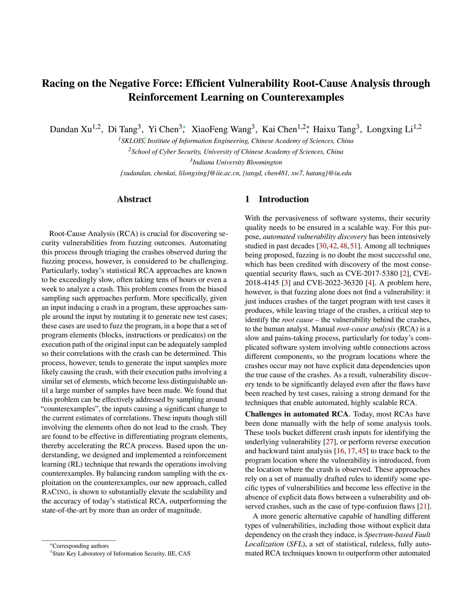

# Racing: Efficient Vulnerability Root-Cause Analysis through Reinforcement Learning on Counterexamples

Racing is an efficient statistical Root-Cause Analysis (RCA) solution that employs reinforcement learning. This repository contains the proof-of-concept implementation of our [paper](https://www.usenix.org/conference/usenixsecurity24/presentation/xu).

<p align="center">
<a href="https://www.usenix.org/conference/usenixsecurity24/presentation/xu-dandan"> </a>
</p>

## TL;DR

You may use our [Dockerfile](Dockerfile) to setup a testing environment.

```bash
# 1. build racing-eval image
docker build -t racing-eval:latest .
# 2. run racing-eval container
docker run --name racing-eval --init -d -v $PWD/examples:/Racing-eval/examples racing-eval:latest tail -f /dev/null
# 3. attach to the container
docker exec -ti racing-eval bash
```

## Environment Setup

Before you start everything, make sure to set the following configurations on your host machine (as required by AFL fuzzing).
```
### use root permission if necessary

echo core >/proc/sys/kernel/core_pattern
cd /sys/devices/system/cpu
echo performance | tee cpu*/cpufreq/scaling_governor

# disable ASLR
echo 0 | tee /proc/sys/kernel/randomize_va_space
```

Racing was evaluated on Ubuntu 20.04. To obtain a clean environment for testing, one can pull the `ubuntu:20.04` image and launch the following container.
```
# download racing code
git clone https://github.com/RacingN4th/racing-code
export RACING_DIR=$PWD/racing-code
# pull and launch container
docker pull ubuntu:20.04
docker run --name racing-rca -v ${RACING_DIR}:/Racing-final -d -it ubuntu:20.04 bash
```
Then attach into the container and install the following dependencies
```
docker exec -it racing-rca bash

### run commands below inside container
apt-get update
apt-get install -y wget make gcc clang-6.0
wget -c http://software.intel.com/sites/landingpage/pintool/downloads/pin-3.15-98253-gb56e429b1-gcc-linux.tar.gz
tar -xzf pin*.tar.gz
export PIN_ROOT="$PWD/pin-3.15-98253-gb56e429b1-gcc-linux"
```

## Racing Build Steps

Racing consists of the following components
- `InstTracer`: A simple tracer to extract instructions that are covered by a vulnerability PoC.
- `Racing-final/afl-fuzz`: A modified implementation of the AFL fuzzer that integrates our reinforcement learning algorithm for efficient RCA.
- `Racing-final/llvm_mode/afl-llvm-pass.so`: An LLVM pass that instruments the PoC-related instructions for tracing their runtime values during fuzzing.
- `scripts`: auxiliary scripts used by Racing.

Building the above components require the following steps
```
# build InstTracer (make sure env PIN_ROOT is set)
cd ${RACING_DIR}/InstTracer
make

# build afl-fuzz
cd ${RACING_DIR}/Racing-final
make

# build llvm pass
cd ${RACING_DIR}/Racing-final/llvm_mode
make
```

## Testing Steps

The `examples` folder contains the scripts for analyzing the 30 vulnerabilities used in our paper. To reproduce it, please refer to the following example:
```bash
cd examples/21-ezXML-nullptr-dereference

# step 1: download source code and build a binary for tracing
./01_build_trace.sh
# step 2: trace the binary's execution with PoC as input
./02_PoCExecutionInspector.sh
# step 3: build a binary for racing's fuzzing process
./03_build_fuzz.sh
# step 4: start racing's fuzzing process (rca)
./04_racing.sh
```

After the above steps, please check `afl-workdir-batch0/ranked_file` for the ranking of predicates.

> [!WARNING]  
> When compiling the binary using racing's afl-clang-fast, please *DO NOT* enable `-j` as racing needs to generate sequential IDs for instructions.


## Cite our paper

Please cite Racing use the following BibTex code:

```
@inproceedings{xu2024racing,
    title = {Racing on the Negative Force: Efficient Vulnerability Root-Cause Analysis through Reinforcement Learning on Counterexamples},
    author = {Xu, Dandan and Tang, Di and Chen, Yi and Wang, XiaoFeng and Chen, Kai and Tang, Haixu and Li, Longxing},
    year = {2024}
    booktitle = {33rd {USENIX} Security Symposium ({USENIX} Security 24)},
}
```